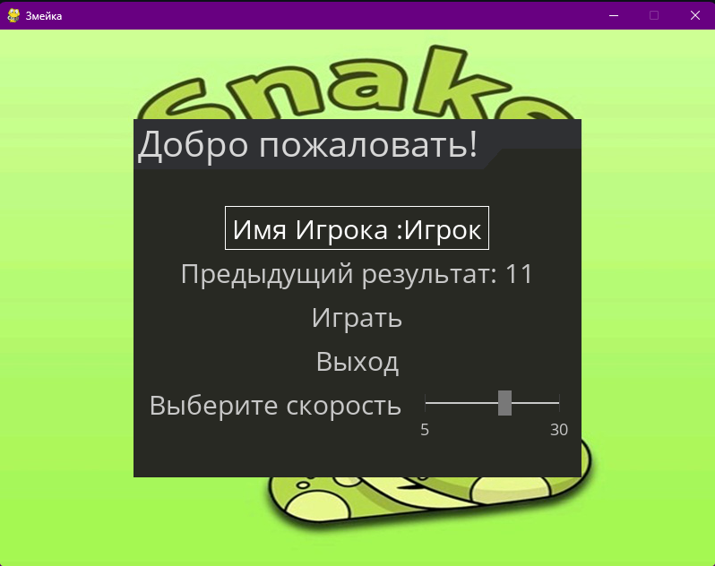
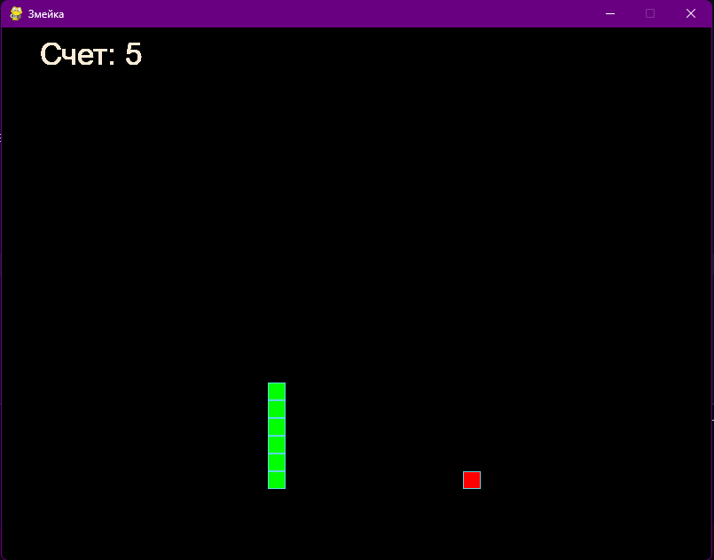

# 🐍 Змейка - Классическая игра


## 📖 Описание

Классическая игра "Змейка", реализованная на Python с использованием библиотеки Pygame. Проект демонстрирует объектно-ориентированный подход к разработке игр с красивым пользовательским интерфейсом и системой сохранения результатов.

### 🎮 Особенности игры

- **Красивое меню** с настройкой скорости игры (5-30 FPS)
- **Система счета** с сохранением лучшего результата
- **Разнообразная еда** (яблоко, банан, апельсин) с разными цветами
- **Плавное управление** змейкой с помощью стрелок
- **Современный дизайн** с градиентными цветами и анимацией
- **Настраиваемая скорость** - выберите комфортную скорость игры

## 🛠 Технологический стек

- **Python 3.8+** - основной язык программирования
- **Pygame** - библиотека для разработки игр
- **Pygame-menu** - создание пользовательского интерфейса
- **ООП** - объектно-ориентированное программирование

## 📸 Скриншоты

### Главное меню


### Игровой процесс


## 🚀 Установка и запуск

### Предварительные требования

- Python 3.8 или выше
- pip (менеджер пакетов Python)

### Пошаговая инструкция

1. **Клонируйте репозиторий**
   ```bash
   git clone https://github.com/QSnock/the_snake.git
   cd the_snake
   ```

2. **Создайте виртуальное окружение**
   ```bash
   python -m venv venv
   ```

3. **Активируйте виртуальное окружение**
   
   **Windows:**
   ```bash
   venv\Scripts\activate
   ```
   
   **macOS/Linux:**
   ```bash
   source venv/bin/activate
   ```

4. **Установите зависимости**
   ```bash
   pip install -r requirements.txt
   ```

5. **Запустите игру**
   ```bash
   python the_snake.py
   ```

## 🎯 Управление

### В игре:
- **Стрелки** - управление змейкой
- **ESC** - выход из игры

### В главном меню:
- **Слайдер скорости** - настройка скорости игры (от 5 до 30 FPS)
- **Поле имени** - ввод имени игрока
- **Кнопка "Играть"** - запуск игры
- **Кнопка "Выход"** - выход из программы

## 📁 Структура проекта

```
the_snake/
├── the_snake.py          # Основной файл игры
├── requirements.txt       # Зависимости проекта
├── README.md            # Документация
├── score.txt            # Файл с сохраненным счетом
├── image/
│   └── snake.jpeg       # Фоновое изображение меню
└── screenshots/         # Папка со скриншотами
    ├── menu.png        # Главное меню
    └── gameplay.png    # Игровой процесс
```

## 🏗 Архитектура проекта

Проект построен на принципах ООП с использованием следующих классов:

- **GameObject** - базовый класс для игровых объектов
- **Snake** - класс змейки с логикой движения
- **Eat** - класс еды с рандомным размещением
- **Score** - система подсчета очков

## 🎨 Особенности реализации

- **Модульная архитектура** - каждый компонент игры выделен в отдельный класс
- **Система сохранения** - автоматическое сохранение лучшего результата
- **Адаптивное меню** - обновление интерфейса после каждой игры
- **Коллизионная система** - корректная обработка столкновений

## 📊 Система счета

- Счет увеличивается при съедании еды
- Лучший результат сохраняется в файл `score.txt`
- Отображение предыдущего результата в главном меню

## 📝 Лицензия

Этот проект распространяется под лицензией MIT. См. файл `LICENSE` для получения дополнительной информации.

## 👨‍💻 Автор

**Евгений Сульжицкий** - [GitHub](https://github.com/QSnock)

### 🔗 Ссылки
- [VK](https://vk.com/idholleyyt)
- [YouTube](https://youtube.com/@QSnock)

---

⭐ Если вам понравился проект, поставьте звездочку!

**Приятной игры! 🎮**
